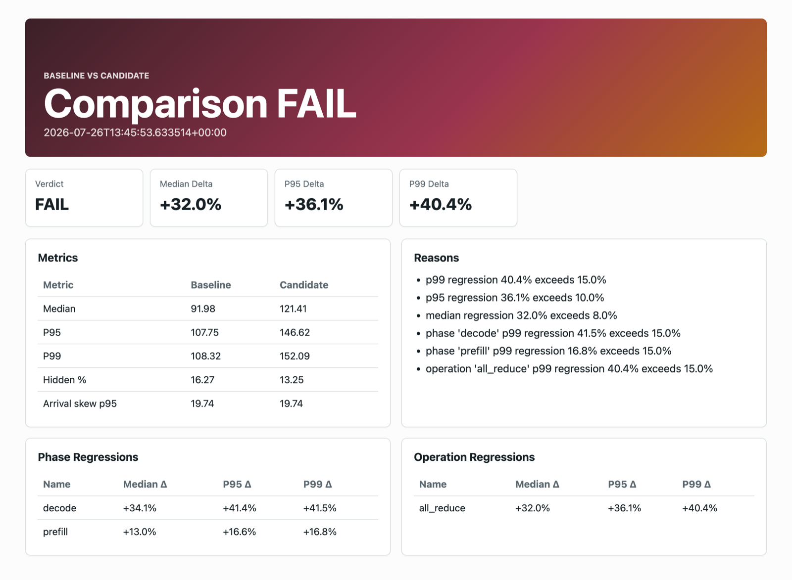

# CommCanary

**We replaced `nccl-tests` with a faithful replay of a tensor-parallel decode
workload's communication. It ranked GPU configurations _worse_ than the
microbenchmark it was built to replace.**

That result is the reason this project exists. Measured on 280 verified cells
across four A100s over 28 configuration pairs, against `W-full`: a four-rank
decode loop of 32 layers × 256 tokens, each layer a sharded GEMM sized to
realistic per-layer decode compute followed by a bf16 all-reduce. It is a
synthetic workload shaped like decode, not a served model — skew and overlap
arise from kernel jitter rather than injection.

| proxy | pair agreement | Kendall τ‑b |
|---|---:|---:|
| `W-shared-overlap` — shared-trace overlap replay | **71.4%** | **0.708** |
| `W-micro` — an isolated microbenchmark, the `nccl-tests` analogue | 64.3% | 0.490 |
| `W-canary` — faithful communication-only replay | **57.1%** | **0.204** |
| `W-canary-overlap` — per-configuration overlap replay | 53.6% | 0.677 |

Replaying the communication exactly is *not* enough. Communication-only replay
scores below the microbenchmark it was built to replace, and ranks
`nccl-2.20.5-tree-ll` — the full workload's worst configuration, +38% against
the best — as second best. Only overlap-bearing replay beats the microbenchmark,
**and it still disagrees on 8 of 28 pairs.**

The fourth row is the honest complication: `W-canary-overlap` carries overlap and
still lands last on agreement. Its medians span 144–178 µs, producing 13 policy
ties that the agreement metric counts as disagreement and Kendall τ does not —
which is why its τ of 0.677 sits far above its agreement.

What this supports is a **decomposition of which trace properties carry a ranking
decision**. It is not decision preservation, and it is not a cost argument: at
this workload size the proxies are not cheaper, with median per-cell wall time of
7.9 s for the full workload against 17.2 s for communication-only replay and
11.4 s for overlap replay.

This generalises past CommCanary. Chakra replay, ASTRA-sim, AICB/SimAI and PARAM
comms-replay all replay communication. This data says communication alone is not
the load-bearing variable.

Every number above regenerates byte-for-byte from
[the frozen evidence](experiments/rostam/results/publications/trusted-join-core-shared-overlap-primary/aggregate.json).

## Try it in sixty seconds

```console
pip install "git+https://github.com/iemAnshuman/CommCanary"
commcanary demo
```

CommCanary is not on PyPI yet, so install from the repository for now.

That compiles a bundled example trace into a canary, replays a baseline and a
deliberately regressed candidate, compares them, and opens an HTML report. It
needs no GPUs, no cluster, and no input files. The replay is a deterministic
simulator over a bundled example, so the demo's numbers illustrate the workflow
rather than measuring your hardware.



That report is what the command above writes. The verdict, the median/p95/p99
deltas, and the per-phase and per-operation breakdown are exactly the values the
demo emits: +32.0%, +36.1% and +40.4%. It is also published from CI at
[iemanshuman.github.io/CommCanary](https://iemanshuman.github.io/CommCanary/),
so the site and the local run cannot diverge.

## What this is

CommCanary's goal is to turn an expensive distributed-AI workload and a
regression policy into a short physical test that predicts whether a stack
change should ship, with enough retained evidence to audit the decision. Chakra
carries the execution graph. CommCanary owns dependency-closed selection,
policy-conditioned minimization, asymmetric regression safety, and the evidence
bundle.

That goal is **not yet achieved**, and this README will not pretend otherwise.
What is built, what is measured, and what remains unproven are listed below.

## Claim status

| Claim | Status |
|---|---|
| Proxy fidelity ranking (the table above) | **Measured** |
| Chakra physical graph ingestion | Implemented and tested |
| Dependency-closed candidate construction | Implemented and tested |
| Training/holdout isolation | Implemented and tested |
| Signed private exchange | Implemented and tested |
| Exact-work configuration fidelity | Promising but **inconclusive** |
| Reduced physical runtime | **Unmeasured** |
| Held-out regression safety | **Unproven** |
| Production CI gate | **Not validated** |
| Multi-node support | **Unsupported** |

The exact-work study agreed on 26 of 28 configuration pairs and measured Kendall
τ‑b 0.857. Its frozen result is still **inconclusive**, because confidence
intervals crossed decision boundaries and one configuration was unstable. It
replayed the complete source-derived program, so it measured neither physical
reduction nor cost savings.

[`claims/public-claims.yaml`](claims/public-claims.yaml) is the machine-readable
source for every statement here, and CI fails if this file disagrees with it.

## Supported domain

```text
single node
exactly four NVIDIA GPUs
tensor-parallel dense-decoder inference
vLLM first; SGLang as the planned replication
GEMM and all-reduce dependency structure
```

Multi-node communication, expert-parallel all-to-all, CUDA graphs, multi-stream
execution, KV-cache pressure, and network congestion are **not** qualified.

## The real workflow

```bash
commcanary capture --output trace.json --chakra-output trace.et \
  --projection-output trace.projection.json --workload-name serving-decode \
  -- python examples/instrumented_decode.py

commcanary build trace.et --projection trace.projection.json \
  --policy study/policy.json --oracle-corpus study/oracle-corpus.json \
  --output serving.canary

commcanary gate serving.canary --baseline baseline.json \
  --candidate candidate.json --output gate.json --html gate.html
```

`build` requires real measured evidence and refuses to proceed without it:
synthetic fixtures cannot qualify a canary, and a bundle built without a real
application corpus exits non-zero and cannot be gated. That refusal is
deliberate. The [operator quick start](docs/operator-quickstart.md) walks the
boundary without fabricating evidence.

## Start here

- [Product status and evidence boundary](docs/product-status.md)
- [Machine-readable public claims](claims/public-claims.yaml)
- [Independent-operator quick start](docs/operator-quickstart.md)
- [Physical canary contract](docs/physical-canary.md)
- [Integrity model](docs/integrity.md)
- [Privacy and exchange](docs/privacy.md)
- [Roadmap](ROADMAP.md)

## Status

**Research alpha, version 0.3.0.** Apache-2.0. The CommCanary name and marks are
reserved as described in [NOTICE](NOTICE).

```bash
python -m pip install -e ".[dev]"
python -m tools.verify --fast
```
